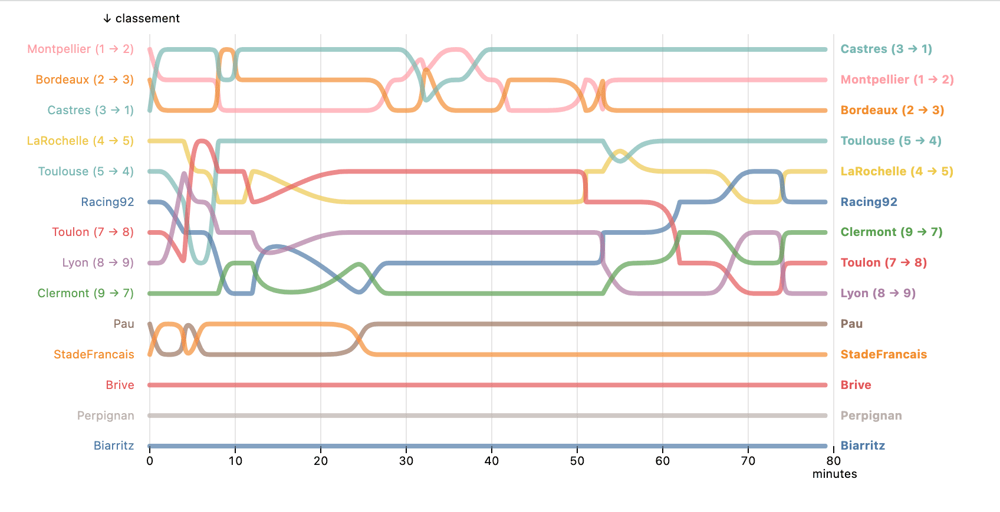

# Touch - Pause - Engage

La dernière journée de Top 14 de l'édition 2021-2022 était particulièrement 
serrée, avec dans le peloton de tête pas mal de clubs dans un mouchoir de poche.

Via ce petit projet, j'ai tenté de représenter l'évolution du classement, minute
par minute.

Pour ce faire j'ai : 

- réfléchi à un modèle de données permettant de retracer le cours d'un match,
  l'évolution du score et l'évolution des points attribués à chaque équipe (en
  fonction du score, des bonus offensifs et défensifs éventuels)
- saisi l'intégralité des actions de marque des 7 rencontres de la 26ᵉ journée
- transformé tout ça en un json que j'utilise ensuite côté front pour grapher,
  avec [Observable Plot](https://github.com/observablehq/plot) l'évolution du 
  classement, action par action.

Et ça donne ça !

Enjoy ❤
